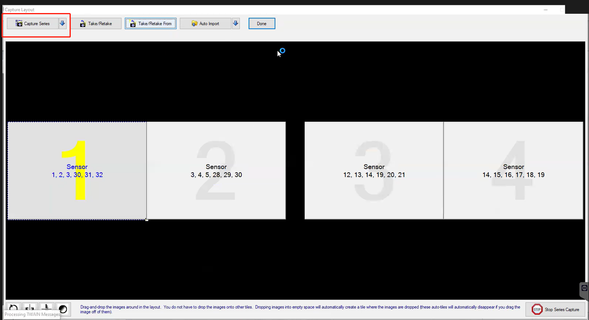

## ADF 传输模型的特点和适用软件

| 传输模型       |       适用软件        |
|----------------|----------------------|
| [B]Simplified  | Archy，OpenDental，XDR，TigerView（单张不关闭源，可实现边采边传）；|
|                | Apteryx(XV)，Curve（单张关闭源，支持伪ADF，支持暂存区批量多张传输）|
| [C]Classic     | 大多数支持ADF的软件使用该版本会出现“延迟一张传输”问题，|
|                | 但Vixwin，LynxVision和EzDent除外（边采边传，不会延迟一张）|               
| [D]Advanced    | EzDent-i, CareStream, Dexis|
|                | 大多数支持ADF的软件使用该版本不会出现“延迟一张传输”问题|

1. 如果上位软件没有默认的传输模型时，需要尝试这三种传输模型，应按照【B】->【C】->【D】的顺序进行测试，直至“连续传输”功能正常，符合预期。
2. 如果测试发现【B】传输模型能适配成功，则停止测试，否则按照顺序测试剩下的【C】和【D】传输模型。
3. 如果测试发现所有的传输模型都不能适配成功，则需要进一步调查上位软件（比如测试竞品对比），根据售后提供截屏或视频，分析原因，确定是否为上位软件问题；
4. 如果传输问题确定为Twain本身的问题，需要拿到上位软件程序（试用版/授权版），进行本地测试和调试。

## 已测试的上位软件支持列表
### Dental 软件
|序号| 上位软件             |   传输模型 |   版本     |   竞品       |  备注  |    问题  |
|--|-----------------------|------------|-----------|--------------|--------|---------|
|1 | CS Imaging            |     B      |   1.4a    | 仅支持单张传输 | 单张传输完成后，关闭源，1.4a可批量上传 | 图片不能进layout格子，D模式关闭后再次打开Twain会闪退 |           
|2 | Apteryx XrayVision    |     B      |   1.4a    |              | 单张传输完成后，关闭源，伪连续ADF | |
|3 | Dexis                 |     D      |   1.4a    |              | B模式下，单张传输完成后，关闭源，伪连续ADF | Twain模块需要授权  |
|4 | VixWin                |     C      |   1.4a    |              | | 不可打开两个Twain UI，否则主程序会卡死|
|5 | OpenDental            |     B      |   1.4a    |              |单张传输完成后，不关闭源| 1.4e正常关闭源，事件查看器异常0xc0000374|
|6 | EzDent                |     D      |   1.4e    |              |1.4a只能支持英文                | |
|7 | Archy                 |     B      |   1.4a/e  |              |单张传输完成后，不关闭源                |伪连续ADF下，偶发崩溃 |
|8 | TigerView             |     B      |   1.4a    |              |单张传输完成后，不关闭源                | |
|9 | Curve                 |     B      |   1.4a    |              |单张传输完成后，关闭源，伪连续ADF        | 1.4e会使得Curve页面最小化|
|10| XDR                   |     B      |   1.4a    |              |可设置单张传输完成后，不关闭源           | 1.4e打开Twain界面，会退出全屏，缩小分辨率|
|11| Core Practice         |     B      |           |              |单张传输完成后，关闭源，伪连续ADF？      |    |
|12| Oryx                  |     D      |   1.4e    |              |必须使用1.4e，上位软件需要设置exe文件路径|    |
|13| DentiView             |     B      |   1.4a    |              | 单张传输完成后，不关闭源    |    |
|14| Sidexis               |     D      |           |              |                |   不能进模板  |
|15| Dentrix Ascend        |     B      |    1.4a   |              | 单张传输完成后，关闭源，伪连续ADF     |  |
|16| Eaglesoft             |     B      |    1.4a   |              | 单张传输完成后，关闭源，伪连续ADF     |  1.4e关闭源后程序崩溃 |
|17| LynxVision            |     C      |           |              |                | |
|18| Sota                  |     B      |           |              |单张传输完成后，关闭源，伪连续ADF，ClioSoft      | |
|19| SOPRO Imaging         |     B      |           |              |单张传输完成后，不关闭源              | |
|20| Progeny               |     B      |           |              |单张关闭源，也不支持“伪ADF”，仅支持批量传输  |  |
|21| iDentalSoft           |     B      |   1.4e    |              |单张传输完成后，关闭源，伪连续ADF         |  |
|22| Dentimax              |     B      |   1.4a    |              |                                       |  |
|23| TDO                   |            |   1.4e    |              |                                       |  |
|24| Dentally Vision(UK)   |     D      |   1.4a    |              |可连续采集                              |  |
|26| MediaDent Bridge      |     D      |           |              |                              |  |
|27| CADI                  |     D      |   1.4a    |              |需要在Twain设置Native传输机制,a和e版本内部测试都ok |  |
|28| Handy Dentist         |     C      |           |              |  |  |
|29| e看牙                  |     B     |           |               |仅支持单张传输|  |

### 通用软件
|序号| 上位软件             |   传输模型   |
|--|-----------------------|--------------|
|1 | PhotoShop             |     B        |
|2 | DynamSoft             |     B        |
|3 | XnView                |     B        |
|4 | IrfanView             |     B        |
|5 | NAPS2                 |     B        |

上位软件调用Twain界面的操作视频可参考[NanoPix Twain兼容软件视频](https://www.youtube.com/playlist?list=PLRMqU9ylVrDxeebvkFFowd46Yiq_o8vny)。

还可参考[Apex Dental Sensor兼容软件视频](https://www.youtube.com/playlist?list=PL7BcoCsLx7VtyhFXZhbAoOsKxCuj_69Ye)。

## 上位软件需要做的设置

### 1. XDR
Close After Transfer不要勾选！！！

### 2. OpenDental
Show Twain UI 要勾选！！！

### 3. Sidexis
Automatic document feed 要勾选！！！

### 4. Archy
测试发现 Run In-Process 需要勾选，要不然有些时候会出现曝光了之后不能出图的现象

### 5. xrayvision
b模式下想要连续拍摄，需在上位软件点击左上的按钮拍序列，单张关闭源，伪ADF

